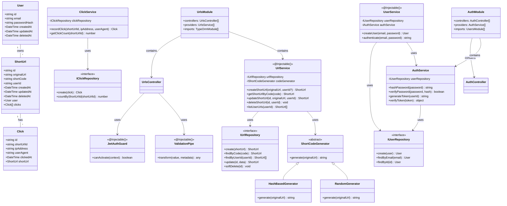
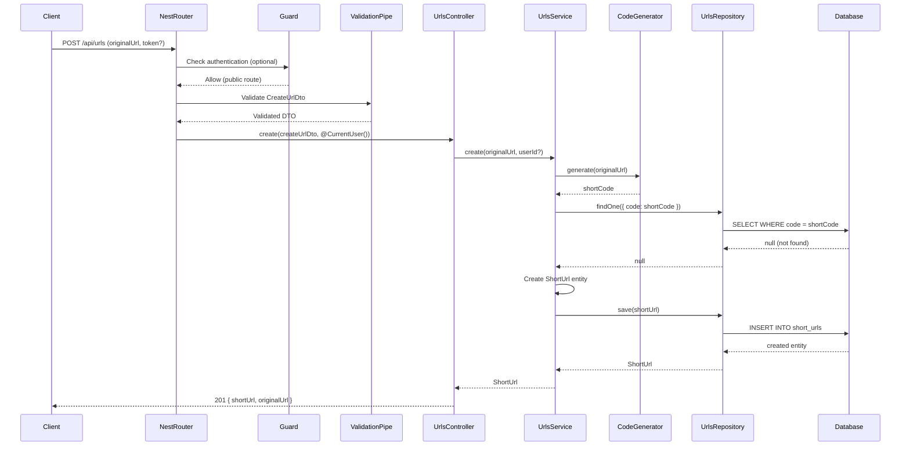
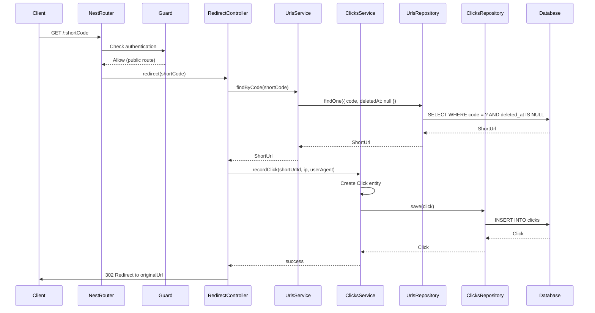
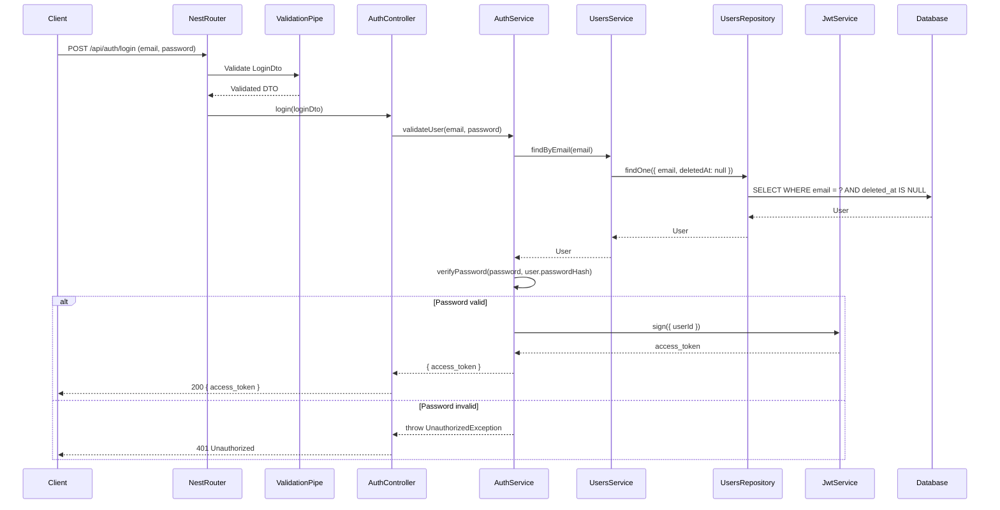
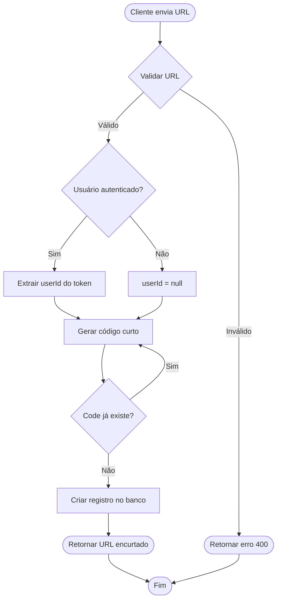
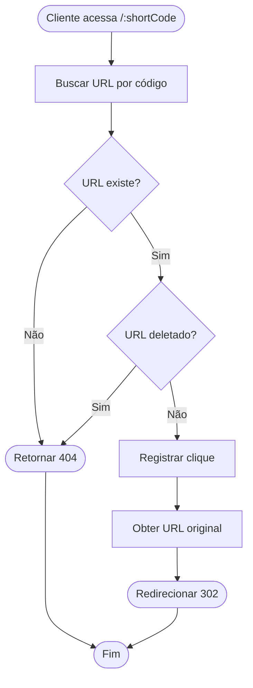
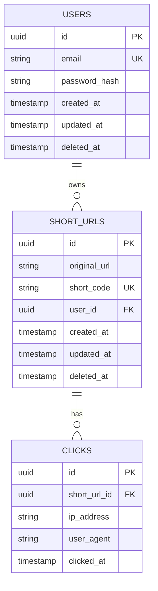
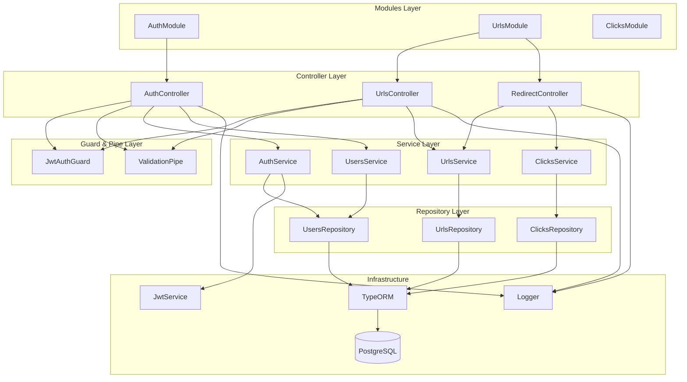

# Diagramas do Sistema

## 1. Diagrama de Classes

## 2. Diagrama de Sequência - Criar URL Encurtado (NestJS)

## 3. Diagrama de Sequência - Redirecionar URL (NestJS)

## 4. Diagrama de Sequência - Autenticação (NestJS)

## 5. Diagrama de Fluxo - Processo de Encurtamento

## 6. Diagrama de Fluxo - Processo de Redirecionamento

## 7. Diagrama de Relacionamento de Entidades

## 8. Diagrama de Componentes (NestJS)

